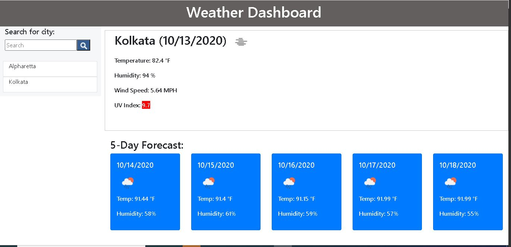

# Weather-Dashboard

This website allows user to find weather details of selected cities. Along with the current weather details. It also provides five day weather forecast. The site is dynamic in nature. 

When user enters a city-

- The city name is displayed and stored in the search history. It remains there even after refreshing the page.

- The current weather conditions is displayed on the right hand side of the screen, five day forecast on the bottom of the screen :
     - City name
     - Date
     - Icon representing the weather conditions
     - Temperature
     - Humidity
     - Wind speed
     - UV index, color coded indicating the weather condition  

- When the user clicks any city from the search history the current and future conditions are displayed again.

- When the page is refreshed the last searched city forecast is displayed.

The weather details are also stored in Local Storage so that the data is not lost on refresh or when the browser is closed.

---
### Screen shots
---

---

- [Github link](https://github.com/arpita-sahakar/weather-Dashboard)

- [Live Website](https://arpita-sahakar.github.io/weather-Dashboard/)
